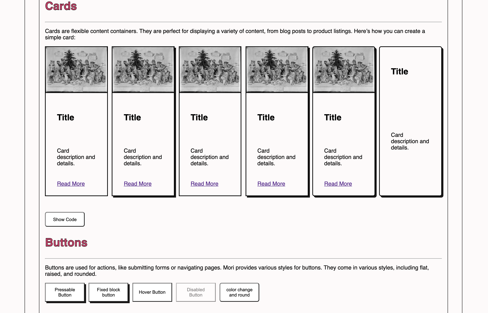
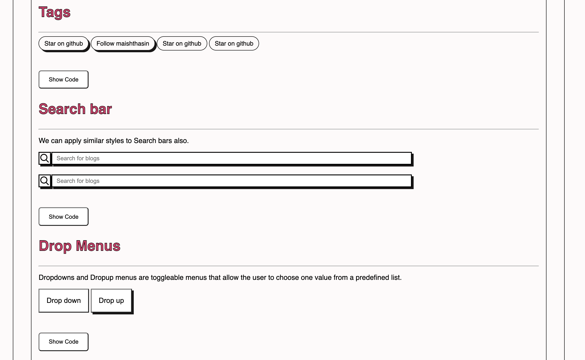
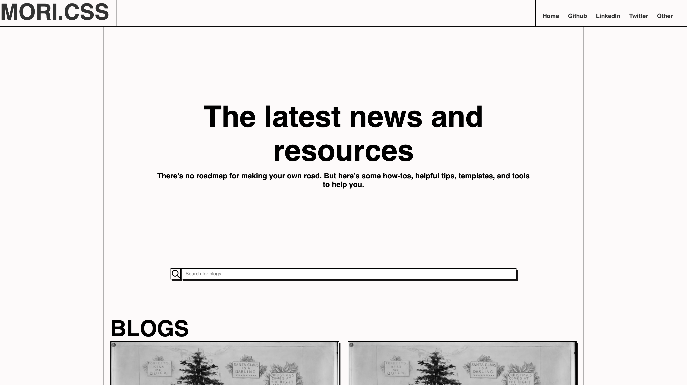
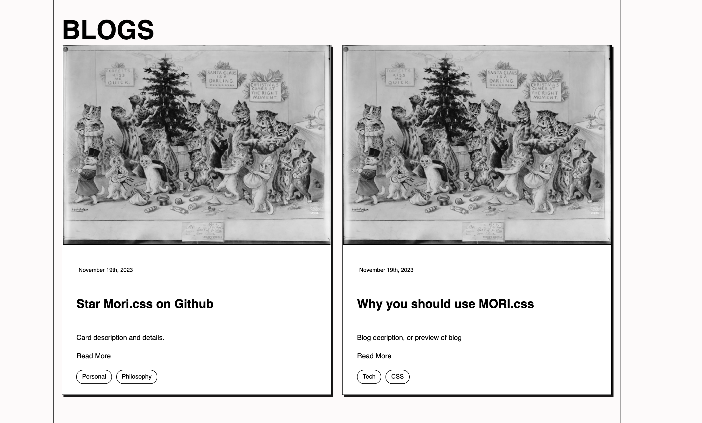

# MORI.CSS

Welcome to MORI.css. Mori CSS Framework is a lightweight, retro-themed CSS library designed for efficiency and simplicity. This framework is designed for web developers looking for something simple and retro. 

### Documentation

Documentation can be found [here](https://maishathasin.github.io/mori.css) 

### Philosophy

My personal philosophy for this project was to create an pretty pages with minimal classes.

### Goals

     
* Minimal: Focusing on essential components
* Retro yet Modern
* Customizable
* Lightweight (&lt; 10kb)  
* Reusable classes

## Screenshots 

 

 

 

## Installation 

## Demo 

The landing page for a starter simple blog: [Blog](https://maishathasin.github.io/mori.css/blog.html)
